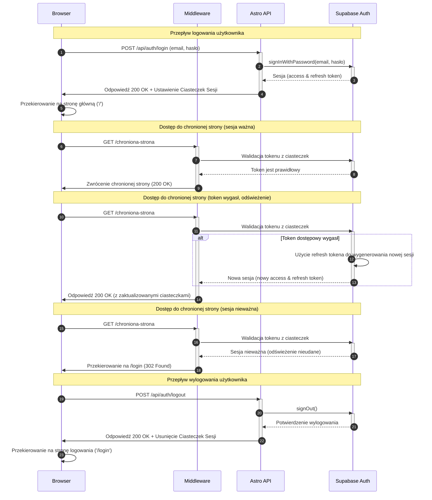

<authentication_analysis>
1.  **Przepływy autentykacji**:
    -   **Rejestracja**: Nowy użytkownik tworzy konto za pomocą adresu e-mail i hasła. Po pomyślnej rejestracji jest automatycznie logowany.
    -   **Logowanie**: Zarejestrowany użytkownik loguje się, podając swój e-mail i hasło.
    -   **Wylogowywanie**: Zalogowany użytkownik kończy swoją sesję.
    -   **Zarządzanie sesją**: Middleware chroni trasy, sprawdzając ważność sesji (tokenu) w ciasteczkach przy każdym żądaniu.
    -   **Odświeżanie tokenu**: Biblioteka kliencka Supabase automatycznie zarządza odświeżaniem wygasłych tokenów dostępowych, o ile token odświeżający jest nadal ważny.

2.  **Główni aktorzy i ich interakcje**:
    -   **Przeglądarka (Użytkownik)**: Inicjuje żądania, przesyła formularze (logowanie/rejestracja) i przechowuje tokeny sesji w ciasteczkach (cookies).
    -   **Astro Middleware**: Działa jako strażnik dla chronionych stron. Przechwytuje każde żądanie, weryfikuje sesję z ciasteczek i przekierowuje niezalogowanych użytkowników. Udostępnia dane sesji do stron przez `Astro.locals`.
    -   **Astro API**: Zestaw endpointów (`/api/auth/*`) obsługujących logikę rejestracji, logowania i wylogowywania poprzez komunikację z Supabase Auth. Odpowiedzialne za ustawianie i usuwanie ciasteczek sesji.
    -   **Supabase Auth**: Usługa backendowa, która zarządza tożsamościami użytkowników, uwierzytelnianiem, wydawaniem i weryfikacją tokenów JWT (access & refresh tokens).

3.  **Procesy weryfikacji i odświeżania tokenów**:
    -   Middleware przy każdym żądaniu do chronionej trasy używa serwerowego klienta Supabase do odczytania i zweryfikowania sesji z ciasteczek HTTP.
    -   Jeśli token dostępowy wygasł, klient Supabase automatycznie próbuje go odświeżyć, używając tokenu odświeżającego.
    -   Jeśli odświeżenie się powiedzie, nowe tokeny są zapisywane w ciasteczkach, a sesja jest kontynuowana.
    -   Jeśli odświeżenie się nie powiedzie (np. token odświeżający również wygasł), użytkownik jest traktowany jako niezalogowany i przekierowywany na stronę logowania.

4.  **Opis kroków autentykacji**:
    -   **Logowanie**: Użytkownik wysyła formularz z danymi. Astro API wywołuje `signInWithPassword` w Supabase. Jeśli dane są poprawne, Supabase zwraca sesję, a Astro API zapisuje ją w ciasteczkach i zwraca sukces, co powoduje przekierowanie na stronę główną.
    -   **Dostęp do chronionej strony**: Middleware sprawdza ciasteczka. Jeśli sesja jest ważna (lub zostanie pomyślnie odświeżona), żądanie jest przepuszczane dalej. W przeciwnym razie następuje przekierowanie do `/login`.
    -   **Wylogowanie**: Użytkownik inicjuje akcję wylogowania. Astro API wywołuje `signOut` w Supabase, co unieważnia tokeny, a następnie usuwa ciasteczko sesji.
</authentication_analysis>

<mermaid_diagram>

</mermaid_diagram>
