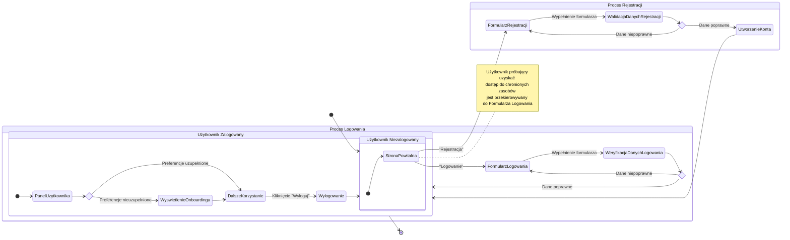

<user_journey_analysis>
1.  **Wypis wszystkich ścieżek użytkownika:**
    -   **Niezarejestrowany użytkownik:** Użytkownik wchodzący do aplikacji jest traktowany jako gość. Dostęp do większości funkcji jest zablokowany i jest przekierowywany do strony logowania. Może przejść do formularza rejestracji.
    -   **Rejestracja:** Użytkownik wypełnia formularz rejestracyjny (e-mail, hasło, potwierdzenie hasła).
        -   *Ścieżka sukcesu:* Po pomyślnej walidacji i utworzeniu konta, użytkownik jest automatycznie logowany i przekierowywany na stronę główną aplikacji.
        -   *Ścieżka błędu (walidacja):* W przypadku błędnych danych (np. nieprawidłowy format e-maila, zbyt krótkie hasło, niezgodność haseł), formularz wyświetla błędy.
        -   *Ścieżka błędu (konflikt):* Jeśli użytkownik z podanym adresem e-mail już istnieje, wyświetlany jest odpowiedni komunikat.
    -   **Logowanie:** Zarejestrowany użytkownik podaje swoje dane uwierzytelniające (e-mail i hasło).
        -   *Ścieżka sukcesu:* Po pomyślnej weryfikacji, użytkownik jest logowany i przekierowywany na stronę główną.
        -   *Ścieżka błędu:* W przypadku podania błędnych danych, wyświetlany jest komunikat o nieprawidłowym loginie lub haśle.
    -   **Zalogowany użytkownik:** Po zalogowaniu użytkownik ma pełen dostęp do funkcji aplikacji.
        -   *Onboarding:* Jeśli jest to nowy użytkownik, który nie uzupełnił swoich preferencji, widzi powiadomienie zachęcające do ich wypełnienia.
        -   *Nawigacja:* Użytkownik ma dostęp do nawigacji pozwalającej zarządzać preferencjami lub się wylogować.
        -   *Wylogowanie:* Użytkownik klika przycisk "Wyloguj", jego sesja jest kończona, a on sam jest przekierowywany na stronę logowania.

2.  **Główne podróże i odpowiadające im stany:**
    -   **Gość:** Stan początkowy, niezalogowany użytkownik.
    -   **Proces Rejestracji:** Stan obejmujący kroki od wypełnienia formularza po utworzenie konta.
    -   **Proces Logowania:** Stan obejmujący kroki od wypełnienia formularza po weryfikację i zalogowanie.
    -   **Użytkownik Zalogowany:** Główny stan aplikacji po uwierzytelnieniu, z dostępem do wszystkich funkcji.

3.  **Punkty decyzyjne i alternatywne ścieżki:**
    -   Czy użytkownik jest zalogowany przy próbie dostępu do strony? (Tak/Nie)
    -   Czy dane w formularzu rejestracji są poprawne? (Tak/Nie)
    -   Czy użytkownik o podanym e-mailu już istnieje? (Tak/Nie)
    -   Czy dane w formularzu logowania są poprawne? (Tak/Nie)
    -   Czy zalogowany użytkownik ma uzupełnione preferencje? (Tak/Nie)

4.  **Krótki opis celu każdego stanu:**
    -   `StronaPowitalna`: Punkt wejścia do aplikacji dla niezalogowanego użytkownika, kierujący do logowania lub rejestracji.
    -   `FormularzRejestracji`: Zbieranie danych niezbędnych do utworzenia nowego konta.
    -   `WalidacjaDanychRejestracji`: Sprawdzenie poprawności i unikalności danych użytkownika.
    -   `FormularzLogowania`: Zbieranie danych uwierzytelniających od istniejącego użytkownika.
    -   `WeryfikacjaDanychLogowania`: Sprawdzenie, czy podane dane logowania są prawidłowe.
    -   `PanelUzytkownika`: Główny widok aplikacji dla zalogowanego użytkownika, zapewniający dostęp do kluczowych funkcji.
    -   `Wylogowanie`: Proces kończenia sesji użytkownika.
</user_journey_analysis>

<mermaid_diagram>

</mermaid_diagram>
