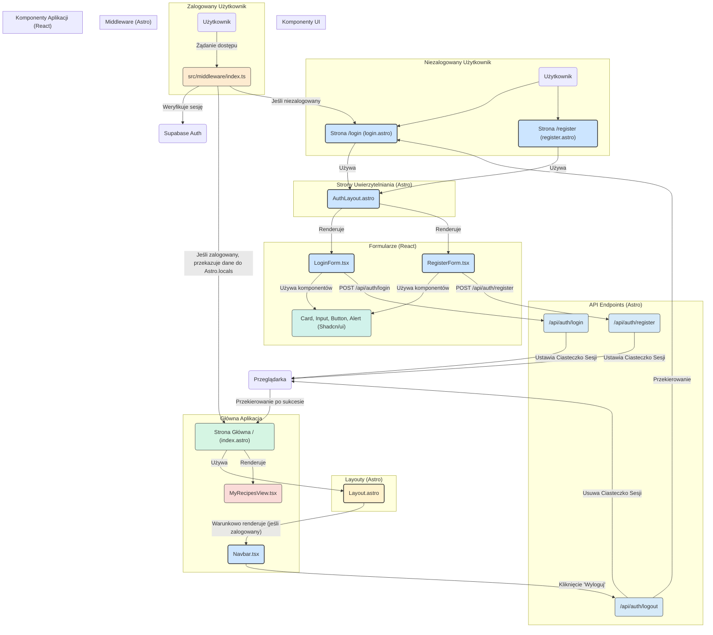

<architecture_analysis>
Na podstawie dostarczonych dokumentów, oto analiza architektury UI dla modułu autentykacji:

### 1. Komponenty i Strony

**Nowe Strony (Astro):**
- `src/pages/login.astro`: Strona zawierająca formularz logowania.
- `src/pages/register.astro`: Strona zawierająca formularz rejestracji.

**Nowe Layouty (Astro):**
- `src/layouts/AuthLayout.astro`: Uproszczony layout dla stron logowania i rejestracji, bez elementów nawigacyjnych zalogowanego użytkownika.

**Modyfikowane Layouty (Astro):**
- `src/layouts/Layout.astro`: Główny layout aplikacji. Zostanie zmodyfikowany, aby warunkowo renderować `Navbar.tsx` tylko dla zalogowanych użytkowników.

**Nowe Komponenty (React):**
- `src/components/auth/LoginForm.tsx`: Interaktywny formularz logowania z walidacją po stronie klienta.
- `src/components/auth/RegisterForm.tsx`: Interaktywny formularz rejestracji z walidacją.
- `src/components/layout/Navbar.tsx`: Pasek nawigacyjny dla zalogowanych użytkowników, zawierający link do preferencji i przycisk wylogowania.

**Komponenty UI (Shadcn/ui):**
- `Card`, `Input`, `Button`, `Alert`: Wykorzystywane do budowy formularzy i wyświetlania komunikatów.

### 2. Główne Strony i ich Komponenty

- **Strona Logowania (`/login`):**
    - Używa `AuthLayout.astro`.
    - Osadza komponent `LoginForm.tsx`.
- **Strona Rejestracji (`/register`):**
    - Używa `AuthLayout.astro`.
    - Osadza komponent `RegisterForm.tsx`.
- **Strona Główna (`/`):**
    - Używa `Layout.astro`.
    - `Layout.astro` renderuje `Navbar.tsx`, jeśli użytkownik jest zalogowany.
    - Osadza `MyRecipesView.tsx`, który jest widoczny tylko dla zalogowanych użytkowników.

### 3. Przepływ Danych

1.  Użytkownik wchodzi na stronę `/login` lub `/register`.
2.  Strony te, zbudowane w Astro (`login.astro`, `register.astro`), renderują odpowiednie komponenty React (`LoginForm.tsx`, `RegisterForm.tsx`) wewnątrz `AuthLayout.astro`.
3.  Komponenty formularzy (`LoginForm.tsx`, `RegisterForm.tsx`) zarządzają swoim stanem (np. za pomocą `react-hook-form`) i przeprowadzają walidację (za pomocą `zod`).
4.  Po wysłaniu formularza, komponent wysyła żądanie `POST` do odpowiedniego endpointu API (`/api/auth/login` lub `/api/auth/register`).
5.  Po pomyślnej autentykacji, API ustawia ciasteczko sesji, a frontend przekierowuje użytkownika na stronę główną (`/`).
6.  Middleware Astro (`src/middleware/index.ts`) przy każdym żądaniu do strony chronionej (np. `/`) weryfikuje sesję.
7.  Jeśli sesja jest ważna, middleware przekazuje dane użytkownika do `Astro.locals`.
8.  Główny layout (`Layout.astro`) odczytuje dane z `Astro.locals` i na tej podstawie decyduje o wyświetleniu paska nawigacyjnego `Navbar.tsx`.
9.  Komponent `Navbar.tsx` zawiera przycisk "Wyloguj", który wysyła żądanie `POST` do `/api/auth/logout`, co kończy sesję i przekierowuje na stronę logowania.

### 4. Opis Funkcjonalności Komponentów

- **`AuthLayout.astro`**: Zapewnia spójny, minimalistyczny wygląd dla stron uwierzytelniania, centrując formularz na ekranie.
- **`Layout.astro`**: Główny kontener aplikacji, który zarządza wyświetlaniem nawigacji w zależności od stanu zalogowania użytkownika.
- **`LoginForm.tsx`**: Odpowiada za zbieranie danych logowania, walidację i komunikację z API w celu zalogowania użytkownika.
- **`RegisterForm.tsx`**: Odpowiada za zbieranie danych rejestracyjnych, walidację (w tym zgodność haseł) i komunikację z API w celu utworzenia nowego konta.
- **`Navbar.tsx`**: Zapewnia nawigację i akcje (wylogowanie) dostępne wyłącznie dla zalogowanych użytkowników.

</architecture_analysis>

<mermaid_diagram>

</mermaid_diagram>
